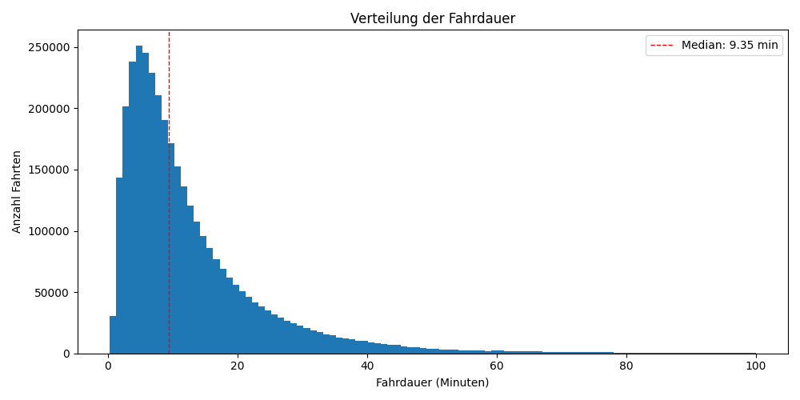
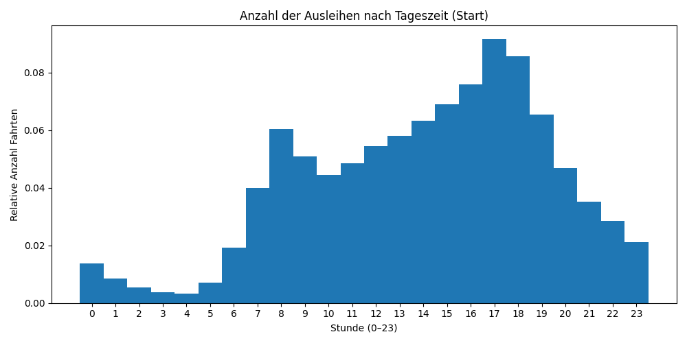
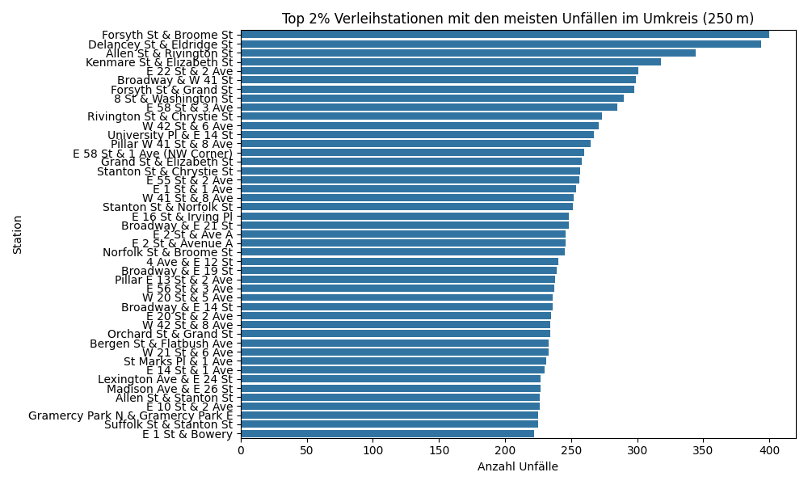
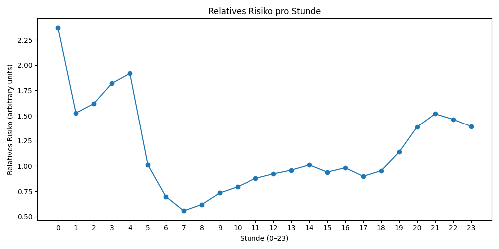
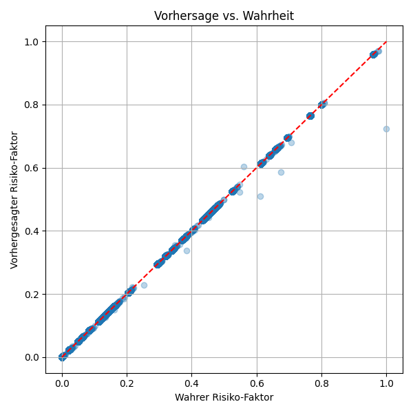

# CitiBike Analyse NYC

Aufgabe: CitiBike helfen, ihre Log-Daten wertstiftend zu nutzen, indem sie mit Informationen des NYPD angereichert werden. Kooperationsmöglichkeiten mit Versicherung skizzieren.

## Zielsetzung
- Risikoeinschätzung für Citibike-Fahrer
- Ableitung von Präventionsmaßnahmen oder Input für ein Produkt

## Datenquellen
- [CitiBike Trip Data (2023)](https://s3.amazonaws.com/tripdata/index.html)
- [NYPD Verkehrsunfälle](https://data.cityofnewyork.us/Public-Safety/Motor-Vehicle-Collisions-Crashes/h9gi-nx95)

## Requirements
- Pure python + libraries, verwende `pip install -r requirements.txt`

## Aufbau des Repos
Im Ordner `scripts/` gibt es zwei Skripte, `main.py` und `predict.py`, Ersteres führt die Analyse durch (s.u. für Details). Letzteres erlaubt es, das entstandene Modell zu laden und z.B. für ein mögliches Produkt/die Kooperation _vor_ Fahrtantritt eine Risikoeinschätzung abzugeben.

## Idee/Vorgehensweise der Analyse
Remarks:
- Die Struktur/Erklärung folgt der Reihenfolge, in der ich die Aufgabe bearbeitet habe, also durchaus explorativen Schritten
- Die Erklärungen in der Readme sind übergreifender Natur, folgen aber dem roten Faden der `main.py`, die top-down geschrieben ist. In der `main.py` finden sich Details.

Die Logik folgt folgenden Hauptschritten:

0. Datenvorbereitung: Laden für spätere Verarbeitung
1. Explorative Datenanalyse: Was steht in den Daten? Was können wir ad hoc lernen?
2. Verknüpfung der Datensätze: Welche Erkenntnisse können wir aus den Daten ziehen? Können wir Risikofaktoren für eine Fahrt identifizieren?
4. Modell: Bau eines kleinen Modells, das für eine Kooperation Citibike<->Versicherung einschätz, ob für eine Fahrt ein erhöhtes Unfallrisiko vorliegt.

Ergebnis:
Ein Modell, dass auf Basis der Merkmale Ausleihzeitpunkt (Uhrzeit in h), Ausleihort (Stationsname), und Nutzertyp (Member/Casual) beurteilt, ob eine bevorstehende Fahrt tendenziell risikogefährdet ist oder nicht (reele Zahl zwischen 0 und 1).
Eine mögliche Kooperation bzw. ein Produkt kann dann beispielsweise sein, dass Citibike seinen Kunden per App warnt: "Achtung, bei der bevorstehenden Fahrt erkennen wir ein erhöhtes Riskio, bitte pass auf dich auf!" und damit die Versicherungsprämie senkt (Hypothetisch erfolgen dadurch weniger Unfälle). Oder aber das Modell kann verwendet werden, um in der Kooperation von Versicherungsseite Risikozuschläge für Citibike für bestimmte Fahrten im Vorfeld zu bestimmen. In jedem Fall ist das Risiko on-demand quantifiziert und vor der Fahrt bestimmt.

### Teil 0
Daten werden geladen. Ich betrachte aus der Polizeistatistik nur Unfälle, bei denen Fahrradfahrer beteiligt sind. -> Erhalte zwei dataframes `citibike_df` und `accidents_df`, mit denen im folgenden gearbeitet wird.

### Teil 1
Das `main.py` Skript beginnt damit einige Verteilungen aus den Daten zu erstellen, um aus diesen etwas zu lernen. Sie finden sich im Ordner `results/01_explorative_data_analysis`, im folgenden wird ein kleiner Teil der wichtigsten Statistiken gezeigt.

Beispiele:





Citibike lernt also einige interessante Sachen, beispielsweise
- Verteilung und Median der Fahrdauer
- Ausleihen nach Tageszeit, i.e. Auslastung
- Nutzergruppenanalyse: Member fahren unter der Woche fahren häufiger als am WE, für Casual ist es umgekehrt.

Wir können auch schauen, welche Stationen stark frequentiert sind, weil dort oft gestartet wird:


oder natürlich welche Stationen kaum genutzt werden und ggf. abgebaut werden können. Hier kann Citibike also die Daten schon mehrwertstiftend nutzen. 

Wenden wir uns der Polizeistatistik zu und schauen uns Unfälle mit Fahrradbeteiligung an:


Wir sehen also nachmittags/abends die meisten Unfälle sowie in den Spätsommermonaten, aber das kommt sicherlich durch ein erhöhtes Fahraufgebot. Relativ zu der Anzahl der eigentlich durchgeführten Fahrten ist es allein aus der Polizeistatistik nicht beurteilbar.

Wir können auch eine interaktive [Heatmap](results/01_explorative_data_analysis/accidents_heatmap.html) der Unfälle in NY erstellen.

**Ergebnis**: Wir haben auf Basis der Daten einige erste Einblicke erhalten. Und wir würden auch sehen, ob die Daten Auffälligkeiten zeigen, bevor wir sie blind in ein Modell geben und Fehler nicht korrigieren. 

### Teil 2
Hier erstellen wir jetzt echte Insights aus der Verknüpfung von Daten.
Zuerst schaue ich für alle Stationen, wieviele Unfälle es in der Nähe einer Station gibt. Nah definiere ich als 250m. Hierfür clustere ich mit der Ball Tree Methode einfach alle Unfälle mit Fahrradbeteiligung im Radius aus der Polizeistatistik. Ich weiß dann dadurch, welche Stationen in Hotspots für Unfälle sind und welche eher nicht. Citibike könnte hier schon dadurch wie oben erwähnt die User per App bei der Ausleihe warnen.



Als nächstes möchte ich ermitteln, zu welchen Uhrzeiten die Unfallgefahr am höchsten ist. Das können wir offensichtlich nicht aus der Polizeistatistik nehmen, weil wir nicht wissen, wieviele Fahrräder auf den Straßen sind. Ich nehme aber an, dass das Citybikefahren sich bezüglich der Uhrzeit identisch verhält wie das private Bikefahren. Damit kann ich dann das Risiko für eine Fahrradfahrt (mit dem Citibike) zu einer Uhrzeit relativ zu anderen Uhrzeiten quantifizieren, z.B. Nachts fahren ist gefährlicher als tagsüber, auch wenn tagsüber mehr Unfälle passieren.




Man kann das natürlich nicht nur für Uhrzeiten machen, sondern auch Wochentage/Jahreszeiten etc., aber ich widme mich lieber noch einem anderen Merkmal. Ich will wissen, ob es Unterschiede bei den Nutzern gibt (Member vs. Casual). Hier helfen die Polizeidaten nicht, aber wir sehen, dass die Casual Nutzer tendenziell länger unterwegs sind. Die Gründe dafür können vielfältig sein (Pricing, Hürden, etc.). Länger unterwegs zu sein ist für mich jedoch ein Indiz, einem erhöhten Risiko eines Unfalls ausgesetzt zu sein (analog zu mehr km bei einem Kfz!).


**Ergebnis**: Wir haben drei Merkmale gefunden, anhand derer ein erhöhtes Risiko für einen Unfall auftreten kann:
- Ort der Ausleihe
- Uhrzeit der Ausleihe
- Nutzertyp

Eine Kooperation von Citibike mit einer Versicherung kann jetzt natürlich wieder so aussehen, dass Citibike nun über die Gefahren detailliert bescheid weiß und seine Nutzer warnt, dafür eine vergünstigte Versicherungsprämie bekommt. 

### Teil 3
Wir haben drei Merkmale identifiziert, die ein erhöhtes Risiko für einen Unfall indizieren. Diese möchte ich jetzt natürlich gesamtheitlich betrachten und stelle ein Modell auf. Dieses beurteilt auf einer Skala zwischen 0 und 1, ob das Risiko eher hoch (1) oder eher niedrig (0) für eine Verunfallung für eine _bevorstehende_ Fahrt ist. Da ich das für bevorstehende Fahrten mache, kann ich ausdrücklich nicht z.B. die Endstation verwenden, sondern verwende nur Merkmale, die auch vor Fahrtantritt festehen, eben gerade Zeit, Ort, und Nutzertyp bei der Ausleihe. Bedenke: Über den Nutzertyp geht indirekt auch ggf. eine im Schnitt längere Fahrtstrecke ein. Selbstverständlich geht es komplexer, aber es ist ja auch ein MVP.

Ich normiere alle Risiken, da sie bisher auf arbiträren Skalen liegen und ich sie selbst gewichten will. Ich gewichte das Merkmal Nutzertyp niedriger als das Merkmal Zeit und Ort der Ausleihe, das muss man natürlich noch tunen. Jede Fahrt bekommt einen Gesamtrisikowert zugeschrieben
```
citibike_df['risk_factor'] = (
    citibike_df['risk_hour'] * 0.4 +
    citibike_df['risk_station'] * 0.4 +
    citibike_df['risk_user_type'] * 0.2
)
```
und wir können daraus ein Modell konstruieren. Insgesamt 20% der Daten halte ich als Testdatensatz zur unabhängigen Evaluation vor.

Ein erstes Modell verwendet einen `DecisionTreeRegressor`, welches wie folgt aussieht:

Es hat eine Tiefe von 5. MSE, R^2 und Cross validation sehen gut aus, auch Wahrer Risiko-Faktor vs. Vorhergesagter Risiko-Faktor sehen ok aus. Overfitting ist nicht erkennbar. Ich checke auch die Residuen, die gefallen mir allerdings nicht:


 Es liegt eine Tendenz zu positiven Residuen vor, das bedeutet, dass das Modell den wahren Risikowert unterschätzt. Das ist natürlich absolut gefährlich, z.B. für eine Prämienberechnung.

Stellen wir also noch ein anderes Modell auf, diesmal ein `GradientBoostingRegressor` mit einer Tiefe von 3 und einer LR von 0.1. Dieser Regressor zeigt ziemlich gute Ergebnisse (auf dem Testdatensatz):



Die Residuen sehen jetzt besser aus:


MSE geht gegen 0, R^2 gegen 1.

Zuletzt wird das Model noch exportiert. In `predict.py` kann es geladen und ausgewertet werden, es benötigt die Uhrzeit (e.g. 14 Uhr), die Station (e.g. Vesey St & Church St), und den Nutzertyp (e.g. member):
```
        pred = predict_risk(14, "Vesey St & Church St", "member")
        print(f"Vorhergesagter Risiko-Faktor: {pred:.4f}")

        ## Vorhergesagter Risiko-Faktor: 0.1604
```
variieren wir zum Beispiel die Uhrzeit und den Nutzertyp:

```
        pred = predict_risk(4, "Vesey St & Church St", "casual")
        print(f"Vorhergesagter Risiko-Faktor: {pred:.4f}")

        ## Vorhergesagter Risiko-Faktor: 0.7990
```

Die Kooperation kann jetzt so aussehen, dass vor jedem Fahrtantritt das Risiko zu Verunfallen ermittelt und entweder der Nutzer gewarnt wird (z.B. bei Risiko > 0.5), oder die Versicherung eine Tarifierung durchführt auf Basis der Risikoeinschätzung in Verknüpfung mit Daten zu Schadenssummen.